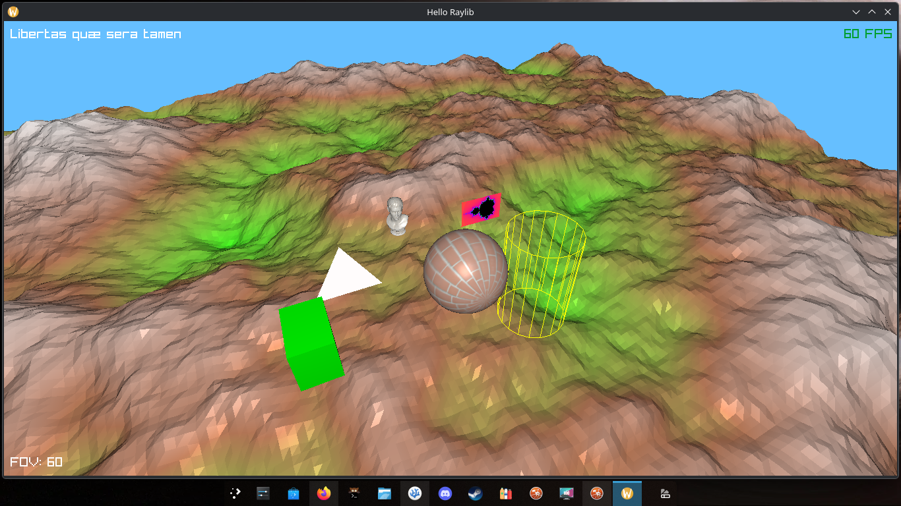

# Hello-Raylib
Project for me to learn Raylib basics. Features infinite chunk terrain, lighting, custom shaders, an `.obj` model and a bit more.

# Image


# Installing
**Requirements:** Raylib (I recommend Raylib Wayland, available on AUR, but standard Raylib does the job as well, except the official version might run on X11/Xorg instead) and GCC. Note this requirements are only for building, as this project does not rely on runtime dependencies.
* Install Raylib:
Standard raylib: `[your package manager install command here] raylib`
Arch (AUR): `yay -S raylib-wayland` or `paru -S raylib-wayland` depending on your AUR helper

**Build:** Run `make` on your terminal and then run `build/bin` or run `make test` to automatically open project.
**Note:** The Makefile is mounted strictly for Linux. Windows is not officially supported, so you may want to compile with MinGW and custom lib flags.

# Usage
The project is more of an interative 3D exibition, so you can simply explore around with:
* **WASD** - Move
* **Mouse** - Look around
* **Shift** - Sprint
* **Mouse wheel** - Change FOV
* **Space/Ctrl** - Go up and down
* **Enter/Esc** - Lock/Unlock cursor
* **P** - Toggle orthographic projection
* **C** - Toggle camera update ("pause" the project)
* **Arrow keys, QE** - Move Mandelbrot Set camera and zoom
* **R** - Makes Mandelbrot Set camera and zoom slower, useful for fine adjustments.
* **L** - Teleport light source to camera

# Structure
```
Hello-Raylib/
├── assets/
|    ├── textures/
|    |   ├── bricks.png
|    |   └── marble_bust_01_diff_4k.png
|    ├── marble_bust_01_4k.gltf
|    └── marble_bust_01.bin
├── example-shaders/
|    ├── lighting.fs
|    ├── lighting.vs
|    └── ...
├── readme-assets/
|    └── screenshot.png
├── shaders/
|    ├── mandelbrot.fs
|    ├── mandelbrot.vs
|    ├── raymarching.fs
|    ├── mandelbrot.vs
|    ├── terrain.fs
|    └── terrain.vs
├── src/
|    ├── libs/
|    |   ├── rlights.h
|    |   └── terrain.h
|    ├── main.cpp
|    └── terrain.cpp
├── .gitignore
├── LICENSE
├── Makefile
├── README.md
```
Assets/ contains essential files for project props; example-shaders is only used for official Raylib simple lighting shader, this is why it's the only shader listed on it, but it has lots of default shaders, such as Conway's Game of Life, Raymarching and post-processing effects; shaders has the custom project shaders used for terrain (lighting shader + height-based color), SDF sphere prop and Mandelbrot Set rectangle prop rendering; src has the source code for the project, which is compiled into the build folder (generated automatically by makefile)

# License
This project is under the **GPLv3** license, which means you're completely free to download, use, distribute and modify this project, but you must distribute the source code of any modifications unde the same GPLv3 license.